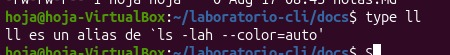
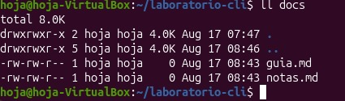

# El comando `alias` en Linux

El comando `alias` permite crear atajos personalizados para comandos más largos o de uso frecuente. Un alias se comporta como un comando propio, pero al ejecutarse expande a la orden completa que se le asignó.

## Crear un alias

Con la sintaxis `alias nombre='comando'` se crea el atajo. Aquí se define `ll` como `ls -lah --color=auto` y luego se ejecuta.

## Verificar un alias con `type`

El comando `type` muestra a qué corresponde un nombre. Con `type ll` se confirma que `ll` es un alias de `ls -lah --color=auto`.

## Usar un alias

Una vez creado, el alias se usa como cualquier comando. Aquí `ll docs` lista el contenido de la carpeta `docs`.

## Eliminar un alias con `unalias`

Con `unalias nombre` se elimina el atajo. Tras ejecutar `unalias ll`, al volver a llamar `ll` la terminal responde que la orden no existe.

## Listar todos los alias

Ejecutar `alias` sin argumentos muestra todos los alias definidos en la sesión actual.

