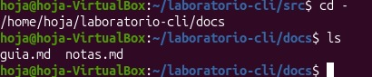
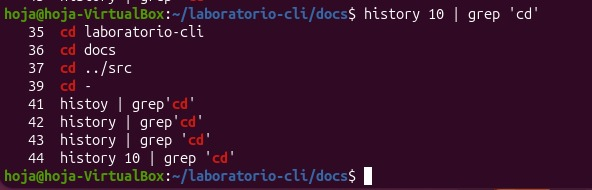
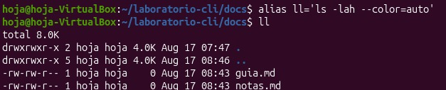
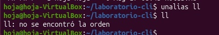
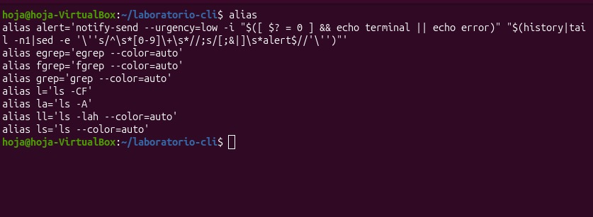

# Práctica: navegación e historial en la terminal de Linux

En esta práctica se trabajó dentro del directorio `~/laboratorio-cli`, practicando la navegación entre carpetas, el uso del historial de comandos y la creación y manejo de alias.

## Navegación entre directorios

Se navegó de forma encadenada entre carpetas usando `cd`: primero a `laboratorio-cli`, luego a `docs`, después a `../src`, y finalmente se listó su contenido con `ls`.

## Regresar al directorio anterior con `cd -`

Con `cd -` se regresó al directorio previo (`docs`) y se listó su contenido con `ls`.

## Filtrar el historial de comandos

Se usó `history 10 | grep 'cd'` para mostrar las últimas entradas del historial que contienen el comando `cd`.

## Crear un alias

Se creó el alias `ll` con `alias ll='ls -lah --color=auto'` y luego se probó ejecutándolo.

## Verificar un alias con `type`

Con `type ll` se comprobó que `ll` es efectivamente un alias de `ls -lah --color=auto`.

## Usar el alias

Se ejecutó `ll docs` para listar el contenido de la carpeta `docs` usando el alias creado.

## Eliminar un alias

Con `unalias ll` se eliminó el alias; al volver a ejecutar `ll` la terminal indica que la orden ya no existe.

## Listar todos los alias

Finalmente, con `alias` (sin argumentos) se mostraron todos los alias definidos en la sesión.

